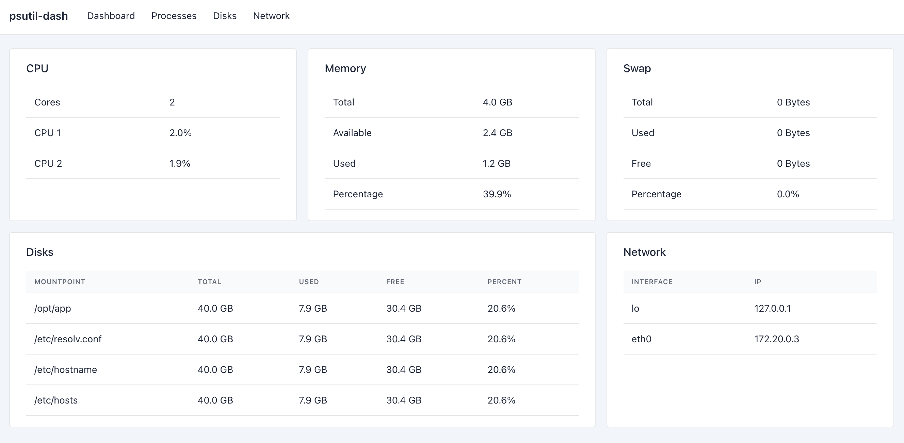
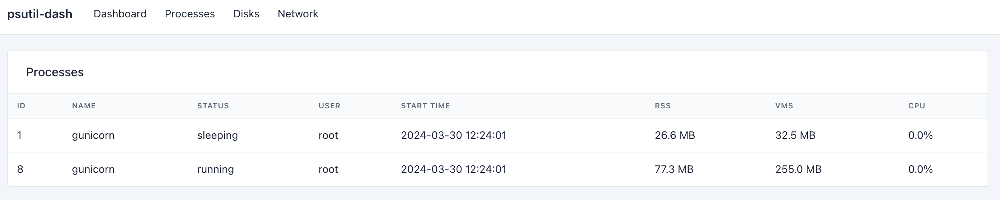
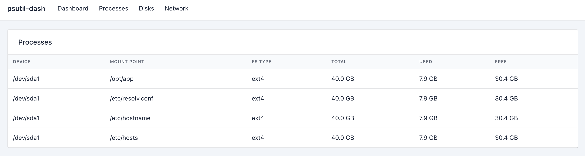
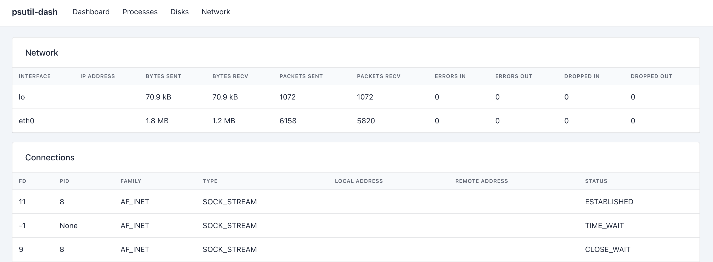

# django_psutil_dash

A Django-based dashboard application for monitoring system resource utilization using the `psutil` library.

## Features

- Real-time monitoring of CPU usage, memory usage, disk usage, and network statistics.
- Easy integration with existing Django projects.

## Installation

1. Pip install the package:

```bash
pip install django-psutil-dash
```

2. Add `django_psutil_dash` to your `INSTALLED_APPS` setting:

```python
INSTALLED_APPS = [
    ...
    'django_psutil_dash',
]
```


## Usage

1. Add the following URL pattern to your project's URL configuration:

```python
from django_psutil_dash.urls import psutil_urlpatterns

urlpatterns = [
    ...
    path('psutil/', psutil_urlpatterns()),
]
```

2. Run the Django development server:

```bash

python manage.py runserver
```

3. Navigate to `http://localhost:8000/psutil/` to view the dashboard.

## Screenshots









## Dependencies

- [Django](https://www.djangoproject.com/)
- [psutil](https://github.com/giampaolo/psutil)


## Contributing

Contributions are welcome! If you encounter any issues or have suggestions for improvements, please open an issue or submit a pull request.

## License

This project is licensed under the MIT License. See the [LICENSE](LICENSE) file for more information.
